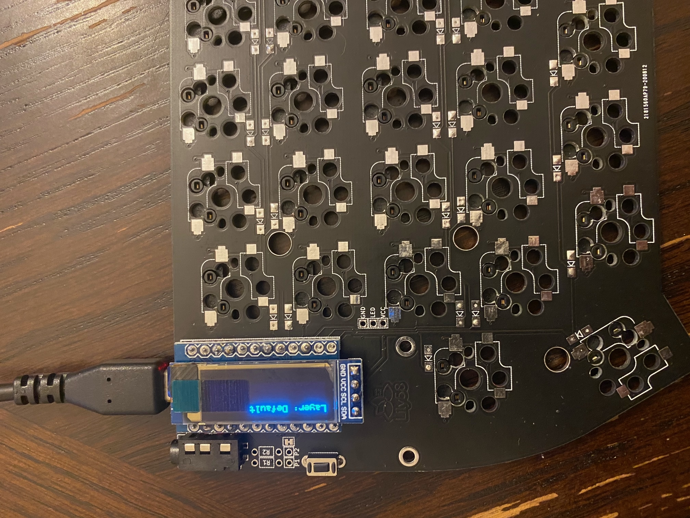

# Lily58 Pro Build

A quick guide for setting up a qmk build environment is detailed [here](https://github.com/rompgadgets/keyboards/blob/main/qmk_setup_wsl2.md)

## BOM

Parts | Company 
--- | --- 
Blue Nylon TRRS Cable | space.design 
MT3 Dasher Keycaps | Drop
6 LED strip per board | Keeb.io 
Boba U4T 62g | Ringer Keys
Micro usb cable | Amazon
Lily58 Pro Kit | Mech.co.uk
3D Printed Tent legs (Rostock Max V3) | Thingiverse
OLED low profile sockets | Little Keyboards
2x Blue OLED (Match color theme) | Little Keyboards
Milmax Pins | Digikey
OLED 4mm 4 pin headers | Samtech

## Build

Following the build guide on [github](https://github.com/kata0510/Lily58/blob/master/Pro/Doc/buildguide_en.md) I got started:

1. Add solder to one pad for each SMD diode.
2. With tweezers place each diode, heating the solder, and sliding the diode onto the melted solder.
3. Add solder to the other pad of the diode.
4. Add solder to one pad for each Kailh switch.
5. With tweezers place each switch, heating the solder, and holding the switch onto the melted solder to make sure it is flush with the PCB.
6. Add solder to the other pad of the switch.
7. Add the TRRS socket.
8. Add the external reset button.
9. Solder in each millmax socket for the microcontrollers.
10. Add pins or diode/LED legs for each microcontroller pin.
11. Solder the jumper pads to enable OLED support on each board.
12. Add pins or diode/LED legs to the OLEDs. 
13. Optional - add LED underglow strips.
14. Install the stand offs for the bottom plate.
15. Install the switches with the top plate.
16. Install the stand offs for the OLED protector.
17. Install the key caps.
18. Finish attaching the top plate to the bottom plate.
19. Optional - add tenting.

It's a good idea to mark the top of the board with tape.  This way you ensure you don't inadvertently solder to the wrong side of the keyboard as you go.  It's also a good idea to test everything as you go to minimize any major errors at the end of the build.  

## Diode solder

First step was soldering on each diode.  The top of the board was marked as suggested by the build guide with a piece of kapton tape to make sure everything was installed correctly on the top/bottom side of the board.

One pad was tinned with a little bit of solder. Using tweezers the diodes were placed on each pad after warming up the tinned side.  Then once the solder reflowed the diode was held in place.  Last the other pad was soldered.  


## Kailh Hotswap Socket 

Adding the Kailh sockets followed a very similar technique. A little bit more focus was placed on putting slight pressure on the socket as it was soldered in place to make sure it was flush with the pcb this way the switches were aligned properly.  Again one pad is tinned, then heated up as the socket is pushed down with a pair of tweezers.  The switches have small pcb mounts, so they hold in place easier than the diodes.  Once one pad was finished then you just got back and add solder on the second pad.


## TRRS and Reset button solder

After the diodes and switches are installed flip the board over (the side wit hthe kapton tape) to add the TRRS jack and reset button.  These are normal through hole parts, so they are very straight forward to add.  You can tape them on the board to hold them flat or just solder one leg and then heat it up while pushing down to ensure its flat.  I went with taping it while soldering in each leg for the TRRS jack.  The reset button fits snugly, so that can just be soldered after pressing it in place.


## Flashing Pro Micros with the qmk-dfu bootloader

I decided after reading some reddit posts to switch the bootloader on the included Pro Micros to the qmk-dfu fork instead of the stock Caterina bootloader.  This [post](https://www.reddit.com/r/olkb/comments/8sxgzb/replace_pro_micro_bootloader_with_qmk_dfu/) highlights the features of the qmk fork as well as the avrdude commands for flashing.  This step requires an AVR programmer and I used a programmer from [Adafruit](https://www.adafruit.com/product/46).  Once connected properly to the Pro micro you can flash the bootloader image after building it with qmk.  The wiring digram can be found [here](https://bcdn.evilmadscientist.com/media/articles/avrtargetboards_1.jpg) for the AVR programmer and [here](https://www.coreforge.com/blog/2014/09/recovering-arduino-pro-micro-atmega32u4/) for the Pro micro.

AVR Pin Out | Pro Micro Pin Out
--- | ---
 | 

Resulting rat's nest:


Make a keymap for the Lily58 either from scratch or copying an existing keymap.  In my case I use VIA, so I made a copy of the VIA keymap.  Then editing the rules.mk by adding 

```
BOOTLOADER = qmk-dfu
```

Next, either build the bootloader image itself or use the production target to build an entire keymap that includes the bootloader.  I did both with the left side pro micro using the bootloader image, and then the right side image using the production hex file.  Afterwards I made sure the left pro micro bootloader update worked by flashing a keymap file using QMK toolbox.

Building the bootloader:
```
qmk compile -kb lily58:default:production -km viasig
or
make lily58:viasig:production
```

Then copy the resulting hex file and flash it using avrdude (I installed the Windows AVR tools distribution as shown on Adafruit).

Flashing just the bootloader hex on the left Pro Micro:
```
avrdude -c usbtiny -p m32u4 -P usb -U flash:w:"lily58_rev1_viasig_bootloader.hex":a -U lfuse:w:0x5E:m -U hfuse:w:0xD9:m -U efuse:w:0xC3:m -U lo
ck:w:0x3F:m

avrdude: AVR device initialized and ready to accept instructions

Reading | ################################################## | 100% 0.02s

avrdude: Device signature = 0x1e9587
avrdude: NOTE: FLASH memory has been specified, an erase cycle will be performed
         To disable this feature, specify the -D option.
avrdude: erasing chip
avrdude: reading input file "lily58_rev1_viasig_bootloader.hex"
avrdude: input file lily58_rev1_viasig_bootloader.hex auto detected as Intel Hex
avrdude: writing flash (32768 bytes):

Writing | ################################################## | 100% 46.68s
```

Flashing the production hex which includes the bootloader and keymap on the right Pro Micro:
```
avrdude -c usbtiny -p m32u4 -P usb -U flash:w:"lily58_rev1_viasig_production.hex":a -U lfuse:w:0x5E:m -U hfuse:w:0xD9:m -U efuse:w:0xC3:m -U lock:w:0x3F:m

avrdude: AVR device initialized and ready to accept instructions

Reading | ################################################## | 100% 0.02s

avrdude: Device signature = 0x1e9587
avrdude: NOTE: FLASH memory has been specified, an erase cycle will be performed
         To disable this feature, specify the -D option.
avrdude: erasing chip
avrdude: reading input file "lily58_rev1_viasig_production.hex"
avrdude: input file lily58_rev1_viasig_production.hex auto detected as Intel Hex
avrdude: writing flash (32768 bytes):

Writing | ################################################## | 100% 45.61s
```

After updating the left side bootloader a test can be done using QMK toolbox to make sure you can flash a keymap as expected.  In order to put the Pro micro in reset you can ground the GND pin and the RESET pin using tweezers.  QMK toolbox should then flash the keymap image and VIA will recognize the Pro micro as a Lily 58.

## Solder the OLED jumpers

At this point its a good idea to put solder across the jumpers to enable the OLEDs.  This is pretty straight forward if using enough heat on the soldering iron and solder.  Each pad should end up bridged as seen here.  


## Pro Micro Socketing

For socketing I used the millmax ultra low profile sockets with  millmax pins.  The sockets were from Little Keyboards, and the pins from Digikey.    

First the sockets are placed inside the rectangles on the top side of the board (marked with tape). 

Bottom view of the installed millmax sockets:


And then the socket is soldered to the PCB.  I used kapton tape to keep each socket secure once I flipped over the board to solder each pin.  

Once the sockets are in place the millmax pins then need to be installed.  The best way I found to place the pins is using some small pliers and then gently pushing down on the pin after its placed inthe socket until a small click is heard.  

Sockets with pins installed: 


Now the Pro micro is placed upside down on the pins. And each pin is soldered to the micro


Now the Pro micro is socketed and can be removed from the PCB.  I found the fit of the millmax pins really tight and needed to gently pry the Pro micro off the pcb board using tweezers and working from front to back.  Each time I removed the microcontroller I ended up bending the millmax pins and even broke one off.  I was able to quickly solder a replacement pin in, but make sure you are careful when removing the microcontroller from the board.  I have since found using diode or LED legs instead of the pins makes an easier fit.

After reinstalling the Pro micro I tested each key with VIA to make sure everything was working as expected.


I moved the key to a few hotswap sockets and made sure VIA registered a key press.  Once that was successful it was time to move to installing the OLED.

## OLED Socketing

I started looking for headers that were less than the traditional 8 mm of insulation.  This [article](https://hackaday.io/project/167369-picopew/log/170776-low-profile-pin-headers) from Hackaday helped identify headers to try out.  I found 4.5 mm low profile headers from Samtec part no: SLW-104-01-G-S.  These work with the normal 4 pin headers that come with OLEDs. I also bought low profile millimax sockets from Little Keyboard with the blue OLEDs and in the end went with the millmax sockets.  I used LED legs that were left over from my [Iris Rev 4](https://github.com/rompgadgets/keyboards/blob/main/iris/build_guide.md) build. 

Installing the LED legs as header pins for the OLED:


These sockets and LED legs fit great and the OLED sits right on top of the Pro micro.  This easily fits under the OLED stand offs for the protective screen included with the acrylic case with the kit.


Once the LED legs were installed it was time to test the OLED.



## LED strip

I bought the LED strips from Keebio, but in the end did not install them.  I may revisit this decision, but at the moment this build is going without RGB underglow.  A strip with 6 LEDs should fit easily on each board for a total of 12 LEDs. 


## Switch Plate install

The plate should sit flush with the PCB.  The switches will push through the plate and then into the hotswap sockets holding everything in place.  As usual start with the corners to get alignment and then move inside with the rest of the switches. 


## Switch install

Switches are the 62g Boba U4T tactiles.  The install was pretty straight forward, but definietly double check the switch pins as they can easily bend when inserting it into the hotswap sockets.  I had a few switches where the pins bent and the switch wouldn't work. It was easy to remove the switch straighten the pins and then push them back in the socket.


## Keycaps Added

I went with the ortho MT3 profile Dasher set from Drop.  The originals look great as can be seen here from a terminal from the 70s: 


Keycaps installed:


## Tenting Solution

This tenting legs are available on [thingiverse](https://www.thingiverse.com/thing:4493691) and line up perfect with the screws on the bottom of the case.  I printed this on a Rostock Maxx V3 using 10% fill, black PLA filament, 210 degree nozzle temp, and 70 degree bed temp.  The holes for the screws needed to be opened up a bit with tweezers due to some tolerance issues, but once that was done the legs fit great.  These are the 3 centimeter option.


## Final Build

All that was left was to complete was the case.  Installing the stand offs for the OLED protector screen, and securing the switch plate/pcb wit hthe bottom plate.

Here are the shots of the final build.


## Keymap

I've used VIA to build up a keymap that has worked pretty well for normal use as well as programming which requires a lot of special key use. [keymap](keymap/lily58_third.json)

A few modifications were done based on the VIA keymap to add wpm support, enable the qmk-dfu bootloader,and set the master to the right side.

These firmware changes are in the viasig directory in the balance branch located [here](https://github.com/rompgadgets/qmk_firmware/tree/master/keyboards/lily58/keymaps/viasig)

## BONUS: QMK Firmware Modifications to add the Left hand vs Right hand Racetrack Visualization


Having a keyboard with OLED screens meant making some code modifications to create some visualizationms.

Showing the number of left hand key presses for right hand key presses with the standard key logger display.


These mods are in a branch on the QMK fork located [here](https://github.com/rompgadgets/qmk_firmware/tree/balance).

One thing to call out is I did have issues with the OLED not sleeping when the PC it was connected to went into hibernate.  This code snippet seems to [fix](https://github.com/rompgadgets/qmk_firmware/blob/c065f63c31112864ba70aeded8f982b53eff3c63/keyboards/lily58/keymaps/viasig/keymap.c#L279-L282) it.