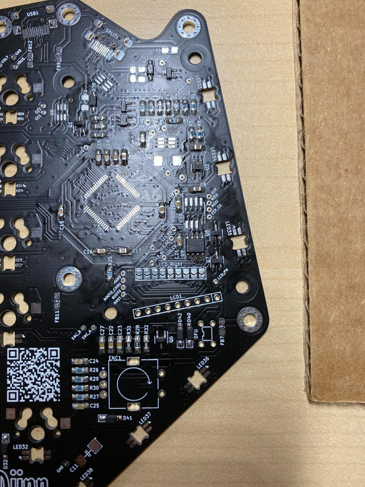

# Djinn Rev 2A Build

Djinn being a test board by tzarc and not a kit leaves everything up to you.  The BOM is listed on the [github](https://github.com/tzarc/djinn/blob/main/Rev2a/Djinn-BOM.md) with links to order parts from LCSC.  You can also find alternatives based on the part number of following approaches like Lady Ada teaches on the [Great Search](https://www.youtube.com/watch?v=BBW_YnjLdjA).

I used the BOM to order parts from LCSC, with alternative parts needed for the MCU, using the STM32484RET6, which in May 2021 was still in stock at Newark.  It is quite difficult to find these MCUs at the moment due to the chip shortage.  I also was able to order parts from mouser and digikey to fill out the remaining required parts.  One item that has been hard to locate is the ferrite bead inductors, so going off the datasheet an alternative was found with a similar resistance curve and specifications (BLM21SP111SH1D, 110ohm 5A).

To get the PCBs and plates you need to download the gerber zip files from the repo and then upload those to JLCPCB (or similar service) to get the top/bottom plate and main PCB.  You can pick board color, surface finish, and a few other options.  I went with all black PCBs and non-leaded HASL.  In a few weeks boards should arrive at your door.


## BOM

Parts | Company 
--- | --- 
BOM | LCSC
Ferrite Inductors | Mouser
MCU STM32484RET6 | Newark
PCB/Plates | JLCPCB
T18-BR02 (Tip) | Hakkoo 
WoB MT3 Keycaps | drop
Kailh Polia Switches | NovelKeys (on sale for $20) 

## Tools
Tool | Company
--- | ---
Amtech 599 (Flux) | Amtech
iFixit Kit (tweezers) | iFixIt
Squirt PS4 | Leatherman
FX-888 | Hakko 
SE400-Z | Amscope

## Build

No official build guide for the [Djinn](https://github.com/tzarc/djinn/tree/main/Rev2a), but Tzarc's Discord channel and the included Kicad project along with the generated [iBom.html](https://github.com/tzarc/djinn/tree/main/Rev2a/bom) should be enough to fill in the gaps.

Recommend having the Kicad project up along with the BOM as you build in case you run into any alignment or part questions.

## Build Tips
Double check the iBom as you go, sort your parts as there is a lot of them, and then double check the components after install just to make sure everything is installed correct.  There are a lot of chances to mix up parts and misplace them during the build.

I made sure to write down component locations as I did each part just to double check I didn't miss any and I got the right part in the right place.  After I was done I'd cross it off my list and check the box on the iBom.html.

It's a good idea to mark the top of the board with tape.  This way you ensure you don't inadvertently solder to the wrong side of the keyboard as you go. 

My overall placement strategy was to go with the smallest profile parts first (Note: or as Tzarc has mentioned solder from least to most expensive components).  

Also recommend that you use good flux to make some of the smaller components easier to solder.  I struggled with the MCU until I got some Amtech 599.

## Diode soldering
Per the iBom.html this will marked on the silkscreen as D1-D42, and remember D38 and D39 are the TVS diodes, so skip those.

First step was soldering on each 1N4148 diode. The top of the board was marked as suggested by the build guide with a piece of kapton tape to make sure everything was installed correctly on the top/bottom side of the board.

One pad was tinned with a little bit of solder. Using tweezers the diodes were placed on each pad after warming up the tinned side.  Then once the solder reflowed the diode was held in place.  Last the other pad was soldered.   


## Resistors
Next up were the 9.1K resistors, followed by the 68K and 120Ohm.  For the 0805 package, I held the component in place with tweezers and then tacked down one side.  After doing all of those I came back and added solder to the remaining pad.  


## Capacitors
The 100uF capacitors are rather bulky, so I did 7 of them but waited to place some more components down for C8 to make sure there was decent clearance.


## SOT/SOIC packages
Tack one leg down while holding it with tweezers.  Then you can just add solder to the remaining legs either just dabbing it or heating up the pad.  I made a mistake on one component and had to remove it.  Without hot air, use solder wick to get as much solder off the legs as possible.  Next, while heating up the pin you can pry it off a bit with tweezers.  Pry just enough to make some space between the pin and the pad.  Then you can just heat up the other side and slide off the component.  




 


## MCU
This package was initially tricky due to an oxidized tip and not the best solder.  To start you tack down each corner so you make sure the MCU is aligned correctly and doesn't move when soldering in the remaining pins.  I attempted to drag solder, but almost immediately had to stop as I was not getting any decent solder flow across the pins.  I also noticed my first attempt ended up misaligned, so I used hot air at 315 degrees fahrenheit with about a 3 on air flow to remove it so I could try again.  This time I used leaded solder, RMA 1806 flux and later Amtech 599, as well a 1.2m chisel tip and it so much easier.  Solder flowed immediately to all the pins and any bridges were easily cleaned up with just a touch up from a clean tip.  I dabbed the chisel against the pins and slowly made my way down each side.    

  


## USB-C Ports
Similar process to "dab" soldering the MCU.  First, tack down one of the pins to hold the port in place.  Then dab solder the remaining pins.  Any bridges can usually be removed with a clean tip and just heating up the pads and pulling the solder away.  If that doesn't work, solder wick can remove any excess.  Note: the two usb-c ports for the Djinn are on the top side of the board (opposite to where the MCU is soldered).  


## Flashing STM32G484REt6 with QMK MSYS
After completing the fuse, adding the DFU reset button, I tested the left hand side by flashing the default keymap

```
[qmk@center qmk_firmware]$ make tzarc/djinn/rev2:default:flash
Making tzarc/djinn/rev2 with keymap default and target flash

Enabling LTO on ChibiOS-targeting boards is known to have a high likelihood of failure.
If unsure, set LTO_ENABLE = no.
arm-none-eabi-gcc (GNU Tools for ARM Embedded Processors 6-2017-q2-update) 6.3.1 20170620 (release) [ARM/embedded-6-branch revision 249437]
Copyright (C) 2016 Free Software Foundation, Inc.
This is free software; see the source for copying conditions.  There is NO
warranty; not even for MERCHANTABILITY or FITNESS FOR A PARTICULAR PURPOSE.

Size before:
   text    data     bss     dec     hex filename
      0   81620       0   81620   13ed4 .build/tzarc_djinn_rev2_default.hex


Size after:
   text    data     bss     dec     hex filename
      0   81620       0   81620   13ed4 .build/tzarc_djinn_rev2_default.hex

Copying tzarc_djinn_rev2_default.bin to qmk_firmware folder                                         [OK]
ERROR: Bootloader not found. Trying again in 5s.
dfu-util 0.9

Copyright 2005-2009 Weston Schmidt, Harald Welte and OpenMoko Inc.
Copyright 2010-2016 Tormod Volden and Stefan Schmidt
This program is Free Software and has ABSOLUTELY NO WARRANTY
Please report bugs to http://sourceforge.net/p/dfu-util/tickets/

Opening DFU capable USB device...
ID 0483:df11
Run-time device DFU version 011a
Claiming USB DFU Interface...
Setting Alternate Setting #0 ...
Determining device status: state = dfuIDLE, status = 0
dfuIDLE, continuing
DFU mode device DFU version 011a
Device returned transfer size 1024
DfuSe interface name: "Internal Flash   "
Downloading to address = 0x08000000, size = 81632
Download        [=========================] 100%        81632 bytes
Download done.
File downloaded successfully
Error during download get_status
make[1]: *** [tmk_core/chibios.mk:407: flash] Error 74
Make finished with errors
make: *** [Makefile:530: tzarc/djinn/rev2:default:flash] Error 1
```
I installed WSL QMK and used that to flash the left and right hand side based on the Keyhive readme.md commands located inside their keymap directory.  Since the keyboard uses the EE_HANDs method to set left versus right I did not use QMK toolbox.

## LEDs Underglow and Per-Key LED
The per key and underglow LEDs are sk6812 mini-e.  Starting with the underglow LED which is LED 33 for the left side, ensures you can test as you go by powering up the board after each LED.   First, I placed the LEDs in place with tweezer and added flux to the tab and pad.  Then using a "dab" solder approach I put a small amount of solder on my j-tip and then let the heat do the work.  Just placing the tip on the pad the solder would immediately cover the pad and tab.  Only need to touch the pad with the soldering iron for barely one second.  Occasionally you might get solder stabs with this approach, but if that happens just apply some more flux and then reflow solder and it should ball up nicely.


Early testing of both sides connected for the first time with only the underglow LEDs soldered on the right side.


Testing animations once all the key LEDs were soldered in:


## Hotswap Socket 
Adding the sockets was straight forward.  The pads are pretty small on this board, so just placing the socket down and then just directly soldering each pad was the best approach while gently pressing down w/ a finger or tweezers.  


## LCDs


LCDs have jumpers that needed to be soldered and then finally headers installed.  They will be held onto the board with the mounting hardware that wil lbe installed during final assembly.


The LCDs may have glitches so make sure to buy a few extra.


After replacing everything started working fine.


## Encoders
The Djinn supports two encoders.  These are similar to other keyboards and straight forward to solder in especially after all the SMT components.  

## Tactile Button 
The tactilce switch is a little tricky to ensure it is placed in the correct orientation.  Using the Djinn design files you can verify the right pin alignment along with the components datasheet (use the GND pin as the landmark).  So make sure you have the part lined up correctly before you solder in.  


## Switches
The switches will push through the plate and then into the hotswap sockets holding everything in place.  As usual start with the corners to get alignment and then move inside with the rest of the switches. 


## Keycaps Added

These are WoB MT3 keycaps from Drop.


Keycaps installed:


## Case Assembly


Mounting hardware is all listed in the BOM and can be found on aliexpress.  The plates just sandwich together.


The top plate will screw to the top of the pcb and then the bottom plate will screw into the bottom of the pcb.


## Final Build

Here are the shots of the final build.


## Debugging

Tzarc has added a [troubleshooting guide](https://github.com/tzarc/djinn/tree/main/Rev2a/Troubleshooting) that can be helpful if you run into any issues.

## Keymap Modifications 

Just modify the djinn keymap file (```/qmk_firmware/keyboards/tzarc/djinn/keymaps/ ```) from Tzarc's branch with your preferred keymap and flash that build and you are all set.
