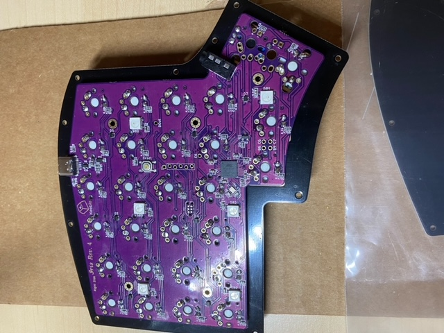
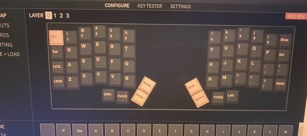

# IRIS Rev 4 Build

## BOM

Parts | Company 
--- | --- 
Nylon TRRS Cable | space.design 
YMDK Carbon Keycaps | Amazon
1.8 mm diffuse white LEDs | Evil Mad Science LLC
Kaihl Box Navy | NovelKeys
3M Rubber Feet | Amazon
Type C to Type A USB Cable braided | Amazon
1/4" Carriage Bolt | Home Depot
1/4" Hex Nuts | Home Depot
IRIS Rev 4 Kit | Keeb.io
3D Printed Middle Layer (Rostock Max V3) | Modified Fusion 360

## Build

Following the build guide on [keeb.io](https://docs.keeb.io/iris-rev3-build-guide). I got started

Stabilizer install was fairly straight forward, but I used this [video](https://www.youtube.com/watch?v=D21Ocg9kVsU) to put together the 2-u stabilizer I used for space on the left hand side.

Next, was installing the rotary encoder on the right hand side.  This step matched the keebio guide exactly.

Third, was putting in each 1.8 mm key switch LED from Evil Mad Science LLC.  I eventually went with placing one of my Kaihl box navy switches on top of the LED and then flipping the board over and soldering the LED in.  The switch was just held in place against my table.  This ensured the LED didn't move during soldering and would fit when the switch was installed later in the build.  There isn't a lot of room for the LED in the box switches, so early on I had some fit issues.

I did have to replace a few LEDs after they were soldered in at this step.  I would do a row and then plug in a USB-C cable to make sure everything lit up as expected.  A few times I ended up with dead LEDs.  I used solder wick and tweezers to replace the LEDs.  I also had to reflow a one LED that flickered out after the build was done.  But that took care of the issue and all the LEDs have worked great since.

Once the LEDs were in place it was time to install the switches on the switch plate and solder them to the board.

As recommended, I started with the 4 corners first and then soldering in the rest.

Once the switches were on testing was done using VIA to ensure there were no dead switches.

The keycaps were then put on.

## Tenting Middle Layer

I used the STL file to print a black PLA tented middle layer from the (keeb.io git hub)[] and had some fit issues.  I make a quick modification in Fusion 360 to reduce the USB-C face plate to make it easier to fit the board in.  Reducing it by roughly 2 mm did the trick.

Due to the tolerances on the printer I did have to drill out the carriage bolt holes and the fastener holes on the final tent layer to ensure everything fit properly.  Modified STL is located [here](stl/iris_rev4_tent_middle_layer_v6.stl)

Iris tented with carriage bolts.

## Wrist Rest Design and Print

Fusion 360 render based on measurements with my iPhone level to match the tenting angle and tape measure to get the wrist distance when actually typing on the Iris.

Used the bottom layer files on the [keeb.io git hub](https://github.com/keebio/iris-case/tree/master/rev3-and-rev4) to ensure the wrist rest fit against the FR4 case.  

]

After printing with 10% fill which took about 5 hours.

There are also holes on the bottom to fit 3M rubber feet to avoid the wrist rest sliding when in use.  STL files for the design are [here](stl/iris_wrist_rest_od_v2.stl)

## Final Build

## Keymap

I've used VIA to build up a keymap that has worked pretty well for normal use as well as programming which requires a lot of special key use. [keymap](keymap/iris_rev__4_second.json)
## QMK Firmware Modifications

A quick guide for setting up a qmk build environment is detailed [here](https://github.com/rompgadgets/keyboards/blob/main/qmk_setup_wsl2.md)

A few modifications were done based on the VIA keymap to set the right side encoder to work as volume up and down except when layer 3 is toggled.  When layer 3 is turned on the encoder switches to scroll up and scroll down.

These firmware changes are in the viasig directory located [here](https://www.github.com)