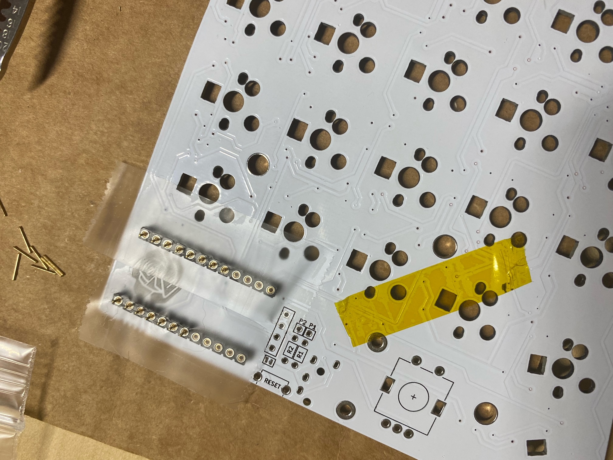
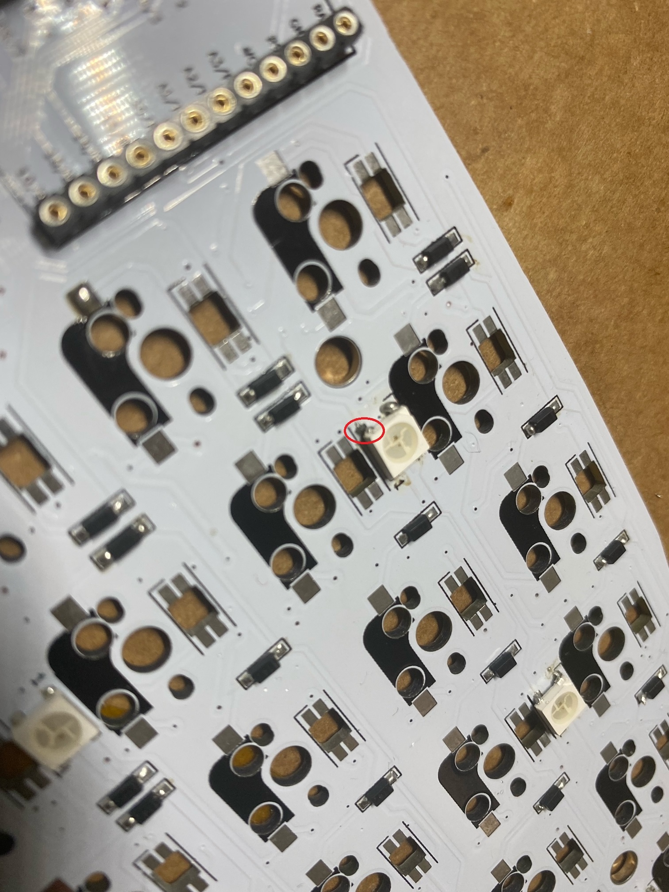
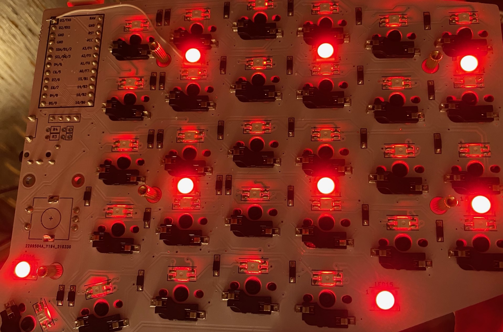

# Sofle RGB Build

Used QMK MSYS for flashing the left/right hand side due to the way Sofle handles split detection.

## BOM

Parts | Company 
--- | --- 
keyhive.xyz | Sofle RGB DIY kit
Qisan PBT Keycaps | Amazon 
Boba U4T 62g Lubed (black/black) | Kirball904 
USB-C Cable Anker | Amazon
Samtec low profile socket for OLEDs | Samtec 
Milmax Pins | Digikey
Milmax low profile sockets for Pro Micro/Elite-C | Digikey

## Build

Following the build guide on [github](https://github.com/keyhive/build_guides/blob/master/docs/keyboards/sofle-rgb.md) I got started:

1. Add solder to one pad for each SMD diode.
2. With tweezers place each diode, heating the solder, and sliding the diode onto the melted solder.
3. Add solder to the other pad of the diode.
4. Underglow LED - eventually went with tin one pad, slide the LED into place and then solder in the rest of the pads.  Make sure the solder covers both the pad and the small side pad of the LED.  Use flux. (Note: I ended up w/ a lifted pad see below for how to fix if this happens)
5. Per-key LED - eventually went with a "dab" solder approach.  Use flux to cover the pads and tabs of the LED.  Then you can add a bit of solder to your tip and just "dab" the pad and the solder gets sucked right in.  If you get solder stabs, just apply some more flux and reflow.  You may also want to increase the temperature.  I used 350C and had zero problems with burning any LEDs out.  I used a J-tip on the Hakko.  
6. Hotswap sockets - With tweezers place each switch, heating the solder, and holding the switch onto the melted solder to make sure it is flush with the PCB.
7. Add solder to the other pad of the switch.
8. Add the TRRS socket.
9. Add the external reset button.
10. Solder in each millmax socket for the microcontrollers.
11. Add pins or diode/LED legs for each microcontroller pin.
12 Solder the jumper pads to enable OLED support on each board.
13. Add pins or diode/LED legs to the OLEDs. 
14. Optional - add LED underglow strips.
15. Install the stand offs for the bottom plate.
16. Install the switches with the top plate.
17. Install the stand offs for the OLED protector.
18. Install the key caps.
19. Finish attaching the top plate to the bottom plate.
20. Optional - add tenting.

It's a good idea to mark the top of the board with tape.  This way you ensure you don't inadvertently solder to the wrong side of the keyboard as you go.  It's also a good idea to test everything as you go to minimize any major errors at the end of the build.  Since this board had so many LEDs, I made sure to flash and install the socketed microcontrollers early on so I could quickly test any soldering issues.  

## Diode solder

First step was soldering on each diode.  The top of the board was marked as suggested by the build guide with a piece of kapton tape to make sure everything was installed correctly on the top/bottom side of the board.

One pad was tinned with a little bit of solder. Using tweezers the diodes were placed on each pad after warming up the tinned side.  Then once the solder reflowed the diode was held in place.  Last the other pad was soldered.  

## Flashing Pro Micro/Elite-C with QMK MSYS

I installed QMK MSYS and used that to flash the left and right hand side based on the Keyhive readme.md commands located inside their keymap directory.  Since the keyboard uses the EE_HANDs method to set left versus right I did not use QMK toolbox.

## Elite-C/Pro Micro Socketing

For socketing I used the millmax ultra low profile sockets with millmax pins ordered from digikey. .    

First the sockets are placed inside the microcontroller plates holes.

And then the socket is soldered to the PCB.  I used kapton tape to keep each socket secure once I flipped over the board to solder each pin.  

Once the sockets are in place the millmax pins then need to be installed.  The best way I found to place the pins is using some small pliers and then gently pushing down on the pin after its placed inthe socket until a small click is heard.  I also used some scotch tape to cover the socket holes to make sure no solder gets inside.    

Now the Pro micro is placed upside down on the pins. And each pin is soldered to the micro

You can use a "" from an iFixit kit to slowly lift the microcontroller working back to front so you can remove it.  

I moved the key to a few hotswap sockets and made sure VIA registered a key press.  Once that was successful it was time to move to installing the OLED.

## Underglow LED Solder

I tried a few different techniques until settling on just tinning one pad, sliding in the LED, and then soldering the rest.  These gave me the most trouble mostly due to how small the pads are and trying to use a lower temperature on the soldering iron.  The ground pad wouldn't heat up until I went up to 330 C.  

I also accidently lifted a pad when trying to remove a badly soldered LED.  The LED was the first LED in series on the left hand side.  I was able to just patch a wire fix, from the pad on the LED to pin 1 (square pad) on the microcontroller.  The LEDs aren't as sensitive as all the warning people typically put in build guides, so as long as you are quick feel free to use 330 C - 350 C.

Once the wire was patched in I was able to quickly test and verify the LEDs were still good.

Here is the final white wire fix trimmed to size:

Left side working

## Per-key LED Solder

The per key LEDs are sk6812 mini-e which are a lot easier to solder than the sk6812 underglow LEDs.  First, I placed the LEDs in place with tweezer and added flux to the tab and pad.  Then using a "dab" solder approach I put a small amount of solder on my j-tip and then let the heat do the work.  Just placing the tip on the pad the solder would immediately cover the pad and tab.  Only need to touch the pad with the soldering iron for barely one second.  Occasionally you might get solder stabs with this approach, but if that happens just apply some more flux and then reflow solder and it should ball up nicely.

## TRRS and Reset button solder

After the diodes and switches are installed flip the board over (the side wit hthe kapton tape) to add the TRRS jack and reset button.  These are normal through hole parts, so they are very straight forward to add.  You can tape them on the board to hold them flat or just solder one leg and then heat it up while pushing down to ensure its flat.  I went with taping it while soldering in each leg for the TRRS jack.  The reset button fits snugly, so that can just be soldered after pressing it in place.

## Hotswap Socket 

Adding the sockets was straight forward.  The pads are pretty small on this board, so just placing the socket down and then just directly soldering each pad was the best approach while gently pressing down w/ a finger or tweezers.  

## OLED Socketing

I started looking for headers that were less than the traditional 8 mm of insulation.  This [article](https://hackaday.io/project/167369-picopew/log/170776-low-profile-pin-headers) from Hackaday helped identify headers to try out.  I found 4.5 mm low profile headers from Samtec part no: SLW-104-01-G-S.  These work with the normal 4 pin headers that come with OLEDs. 

These sockets fit the standard pins that come with the OLED.  

## Encoders

The Sofle supports two encoders.  The long legs fit the PCB and are used to hold the encoder in place while soldering.  This is pretty straight forward through hole part, just make sure you install it on the right side of the board.

## Switch install

The top plate should sit flush with the PCB and slides right over the encoder.  

The switches will push through the plate and then into the hotswap sockets holding everything in place.  As usual start with the corners to get alignment and then move inside with the rest of the switches. 

Switches are the 62g Boba U4T tactiles lubbed and assembled by Kirball904 with a complete black housing.

Finally the bottom plate which is frosted can be installed.

## Keycaps Added

I used a set bought from Amazon called Qisan PBT Keycaps 108 Key Cherry Profile.

Keycaps installed:

## Final Build

All that was left was to complete was the case.  Installing the stand offs for the OLED protector screen, and securing the switch plate/pcb wit hthe bottom plate.  After some LED debugging, reflowing a few solder joints, and modifying the max LED brightness everything was up and running.

Here are the shots of the final build.

RGB animations running: 

## Keymap Modifications 

I had to lower the max brightness of the LEDs to 120 in order to avoid some issues with flickering and the keyboard resetting.  However, once that was set everything worked great.

## Keymap

I've used VIA to build up a keymap that has worked pretty well for normal use as well as programming which requires a lot of special key use. [keymap](keymap/sofle_first.json)